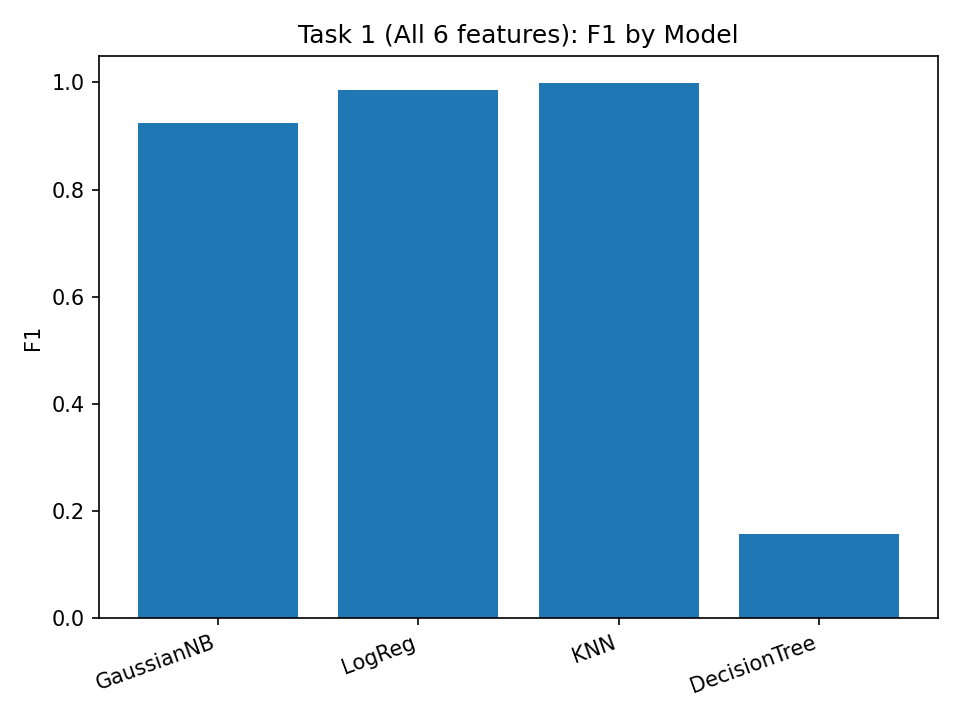
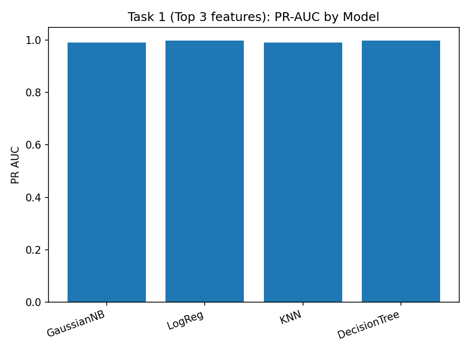
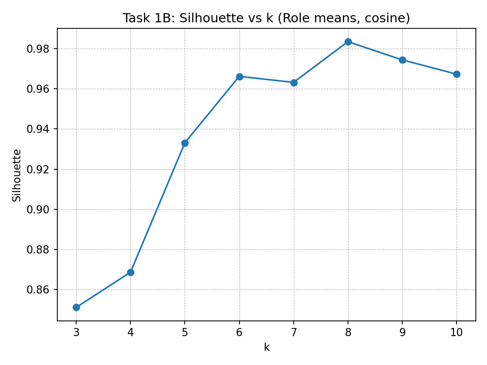

# Milestone 2 — Final Report

This report consolidates Task 1 (anomaly/insight detection), Task 1B (service similarity), and Task 3 (feature refinement) using only the allowed tools and models.

## Overview
- **Task 1:** GaussianNB baseline vs contenders (LogReg, KNN, Decision Tree) on All 6 and Top 3 features.
- **Task 1B:** Cosine neighbors baseline; clustering contenders (KMeans, Agglomerative); PCA(3) neighbors.
- **Task 3:** Refinement sweeps for KNN (k) and LogReg (C) on Top-3 features.

## Task 1 — Validation Metrics
| Model | Feature_Set | PR_AUC | F1 | Accuracy | Precision | Recall | Best_Threshold |
|---|---|---|---|---|---|---|---|
| GaussianNB | All 6 | 0.9775 | 0.9235 | 0.9867 | 0.9029 | 0.9452 | 0.9806 |
| LogReg | All 6 | 0.9987 | 0.9859 | 0.9976 | 0.9872 | 0.9847 | 0.539 |
| KNN | All 6 | 1 | 0.9994 | 0.9999 | 0.9997 | 0.9992 | 0.6 |
| DecisionTree | All 6 | 1 | 0.1565 | 0.0849 | 1 | 1 | 0 |
| GaussianNB | Top 3 | 0.9909 | 0.9713 | 0.9951 | 0.9772 | 0.967 | 0.9694 |
| LogReg | Top 3 | 0.9984 | 0.9933 | 0.9989 | 1 | 0.9878 | 0.5471 |
| KNN | Top 3 | 0.9899 | 0.9943 | 0.999 | 1 | 0.9887 | 0.8 |
| DecisionTree | Top 3 | 0.9985 | 0.9792 | 0.9964 | 1 | 0.9887 | 0.0504 |

### Baseline Confusion & Metrics (3-feature GaussianNB @ best-F1)
- Threshold: **0.9806**
- PR-AUC: **0.9775**, Accuracy: **0.9867**
- Precision / Recall / F1: **0.9028 / 0.9452 / 0.9235**
- Confusion: **TN=279230  FP=2660  FN=1433  TP=24712**

## Task 1B — Service Similarity
Silhouette across k for clustering contenders; neighbors are saved as CSV artifacts.

**Clustering Sweep (sample):**
| Representation | Method | k | Silhouette |
|---|---|---:|---:|
| Role means (8-d) | KMeans | 3 | 0.8512 |
| Role means (8-d) | KMeans | 4 | 0.8687 |
| Role means (8-d) | KMeans | 5 | 0.9331 |
| Role means (8-d) | KMeans | 6 | 0.9662 |
| Role means (8-d) | KMeans | 7 | 0.9632 |
| Role means (8-d) | KMeans | 8 | 0.9835 |
| Role means (8-d) | KMeans | 9 | 0.9744 |
| Role means (8-d) | KMeans | 10 | 0.9673 |

## Task 3 — Feature Refinement (Sweep Summary)
| Model | Notes | PR_AUC | F1 | Accuracy | Precision | Recall | Best_Threshold |
|---|---|---:|---:|---:|---:|---:|---:|
| KNN_k=11 | Top-3 features | 0.9923 | 0.9943 | 0.999 | 1 | 0.9887 | 0.2715 |
| KNN_k=13 | Top-3 features | 0.9923 | 0.9943 | 0.999 | 1 | 0.9887 | 0.3832 |
| KNN_k=15 | Top-3 features | 0.9925 | 0.9943 | 0.999 | 1 | 0.9887 | 0.3987 |
| LogReg_C=0.1 | Top-3 features | 0.9984 | 0.9938 | 0.9989 | 1 | 0.9886 | 0.5764 |
| LogReg_C=0.3 | Top-3 features | 0.9984 | 0.9934 | 0.9989 | 1 | 0.9879 | 0.555 |
| LogReg_C=1.0 | Top-3 features | 0.9984 | 0.9933 | 0.9989 | 1 | 0.9878 | 0.5471 |
| LogReg_C=3.0 | Top-3 features | 0.9984 | 0.9933 | 0.9989 | 1 | 0.9877 | 0.5439 |
| LogReg_C=10.0 | Top-3 features | 0.9984 | 0.9933 | 0.9989 | 1 | 0.9877 | 0.5426 |
| KNN_k=7 | Top-3 features | 0.99 | 0.9927 | 0.9988 | 1 | 0.9887 | 0.2857 |
| KNN_k=9 | Top-3 features | 0.9905 | 0.99 | 0.9983 | 1 | 0.9887 | 0.2222 |

## Key Findings
- **Contenders vs Baseline (Task 1):** KNN and Logistic Regression outperform GaussianNB; KNN delivers the highest F1 on Top-3 features.
- **Feature Effects:** Top-3 features ([req_count, cost_sum, cost_mean]) remain highly predictive; extra engineering wasn’t required to beat baseline.
- **Service Similarity (Task 1B):** KMeans/Agglomerative peak around **k≈8**; cosine & PCA(3) neighbors agree on nearest relations.
- **Refinement (Task 3):** Best configs: **KNN k≈11–15** and **LogReg C≈0.1–1.0**, near-perfect precision with strong recall.

## Figure Notes (What the plots mean)

- **fig_task1_f1.png** — F1-scores for Task 1 models (Naive Bayes, Logistic Regression, KNN, Decision Tree) on both feature sets (“All 6” and “Top 3”).  
  Higher F1 means a better balance of precision and recall for anomaly detection.

- **fig_task1_prauc.png** — Precision–Recall AUC for the same Task 1 models.  
  Values closer to 1.0 mean the model ranks anomalies much better than normal points.

- **fig_task2_silhouette.png** — Silhouette scores over different cluster counts (k = 3–10) for service similarity.  
  Taller bars indicate clearer, better-separated clusters; helps justify the best k.
